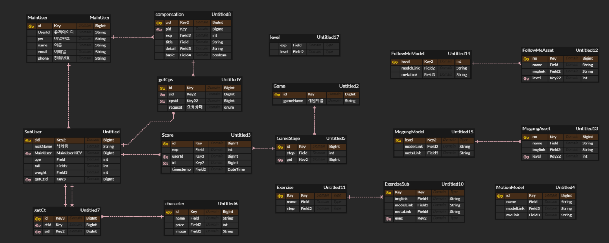

### 빌드 및 배포 작업문서

#### 1. 설정값 및 버전

| 기술       | 버전              |
| ---------- | ----------------- |
| JAVA       | openjdk 1.8.0_192 |
| MYSQL      | 8.0.27            |
| React      | 17.0.2            |
| Nginx      | 14.17.3           |
| Springboot | 2.5.5             |
| VSCode     | 1.61.0            |
| STS        | 3.9.14.RELLASE    |


#### 2. 빌드 시 사용되는 환경 변수

openjdk : 8-jdk-alpine

node : lts-alpine

nginx : stable-alpine


#### 3. 배포 시 특이사항 기재

- Frontend와 Backend를 각각 배포되도록 Jenkinsfile과 Dockerfile을 설정하였습니다.


#### 4. 데이터베이스 접속 정보 

```yaml
spring:
  datasource:
    url: jdbc:mysql://k5d205.p.ssafy.io:3306/finalproject
    username: ssafy205
    password: k5d205
    driver-class-name: com.mysql.cj.jdbc.Driver
```

- ERD Diagram

