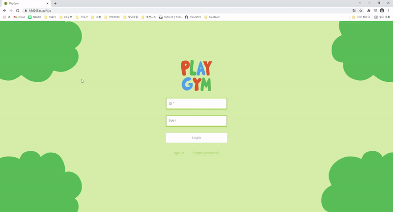
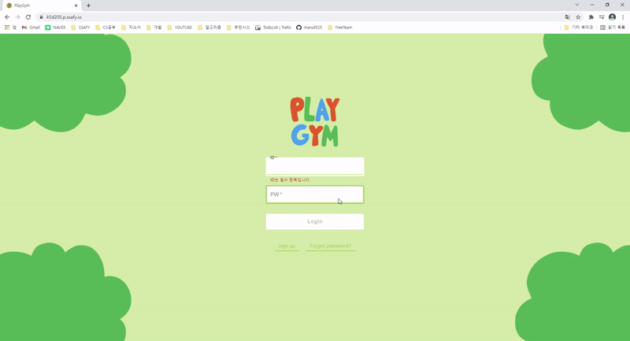
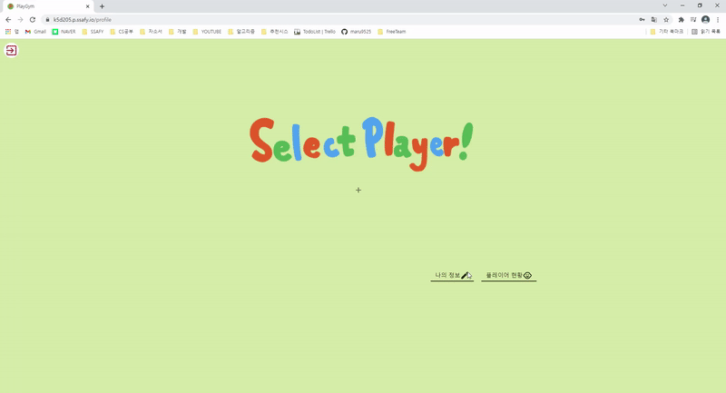
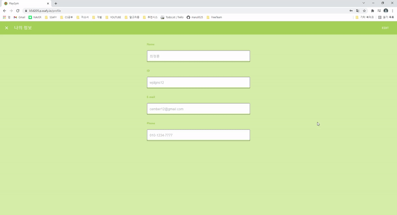
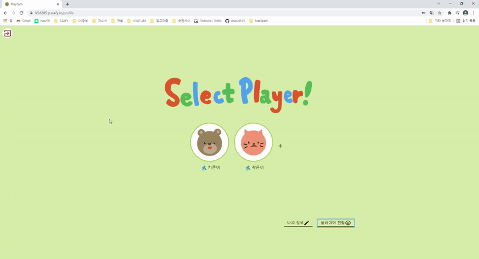
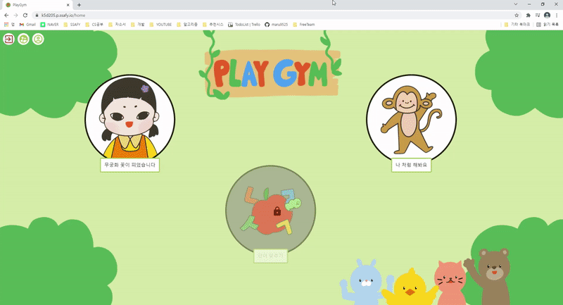

### 시연 시나리오

## 테스트 계정

ID: fortest

PW: ssafyssafy00!

## 1. 최초 페이지

https://k5d205.p.ssafy.io/

- 회원가입

  

  - 이메일 입력
  - 아이디 입력 + 중복확인
  - 비밀번호 입력 + 비밀번호 확인
  - 이름 입력
  - 전화번호 입력
  - **회원가입 버튼 클릭**

  

- 로그인

  - 존재하지 않는 아이디일 때 → alert

  

  - 로그인 성공

  

## 2. 플레이어 선택 페이지

- 플레이어 추가

  

  - 닉네임 입력
  - 나이 선택
  - 키와 신장 선택하고
  - Add 버튼 클릭

- 회원정보 수정

- 
  - Edit 버튼 누르고 정보 수정 후
  - Save 버튼 누르면 수정 완료

- 회원정보 탈퇴

  - 

  - 회원탈퇴 누르면
    - 탈퇴확인 alert
    - 탈퇴 버튼

- 플레이어 현황

  

  - 보상
    - (1번째 플레이어)보상 목록 클릭
      - 보상 리스트 조회됨
      - 보상 수여 하기 버튼 클릭하면 보상 수여(오프라인) + 보상 목록에서 삭제됨
    - OOO님에게 보상 추가하기
      - 보상 입력 + 추가 버튼 클릭하면 보상 목록에 추가됨
  - (추가한)계정 삭제
    - 계정삭제 버튼 클릭 시 → alert
    - 쓰레기통 아이콘 버튼 클릭 시 → 계정 삭제됨 + 플레이어 선택 페이지로 돌아감(계정 삭제된 것 확인 가능)

## 3. 게임 메인 페이지

## 4. 무궁화꽃이 피었습니다

- 게임 시작 3초 카운트 다운
- 게임 시작
  - '무궁화 꽃이 피었습니다' 사운드 재생 + 따라할 모션 이미지 나옴
  - 3초간 동작 유지
    - 동작이 맞으면 화면 테두리 초록색 +  앞으로 한칸
    - 동작이 틀리면 화면 테두리 빨간색 + 그대로
  - 3개 동작 모두 맞으면 성공 메시지 창
  - 아닌 경우 실패 메시지 창
  - 
    - 다시하기 / 게임 메인으로 돌아가기 버튼

## 5. 날 따라 해봐요

- 게임 시작
  - '날 따라 해봐요' 사운드 재생 + 따라할 모션 이미지 나옴
  - 사운드 끝나는 시점에서
    - 동작이 맞으면 화면 초록색
    - 동작이 틀리면 화면 빨간색
  - 좌상단 프로그레스바 꽉 찰 때까지 반복
  - 모든 동작 중 4개 이상 성공한 경우 성공 메시지 창
  - 아닌 경우 실패 메시지 창
    - 다시하기 / 게임 메인으로 돌아가기 버튼

## 6. 자녀 마이페이지

- 목표 달성율

  - 게임 성공 시 프로그레스 증가
  - 꽉 찬 경우 우측 별을 클릭하여 보상을 얻을 수 있음

- 보상

  

  - 보상은 순서대로 해금됨
  - 4개의 캐릭터를 순서대로 해금한 후
  - 부모가 설정한 보상을 차례로 수여받을 수 있음