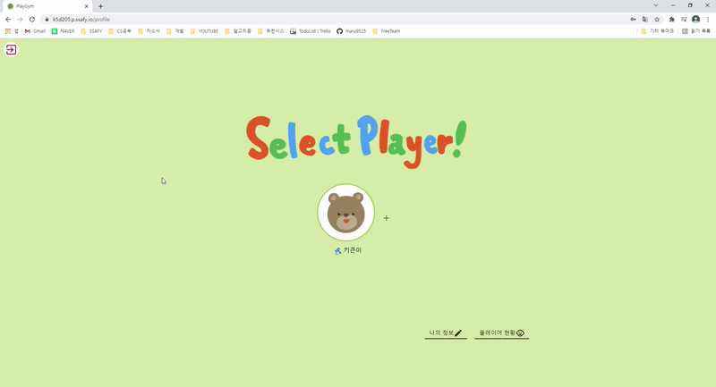
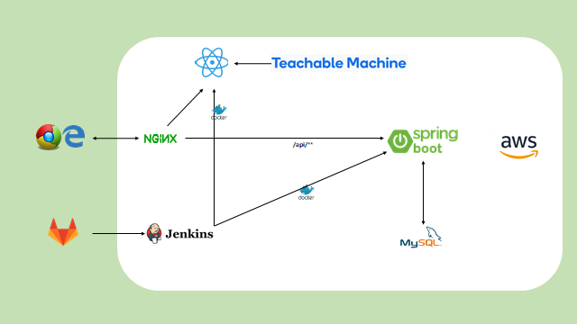
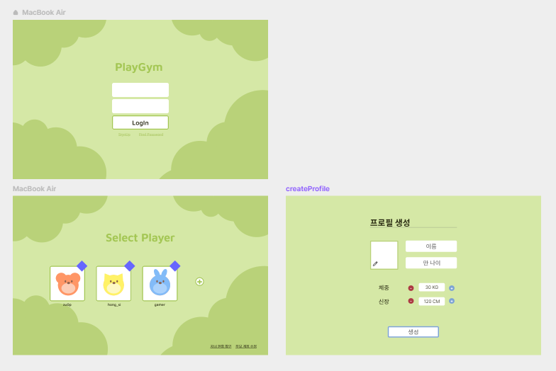
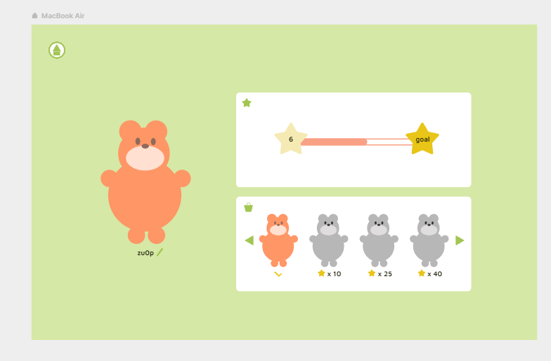
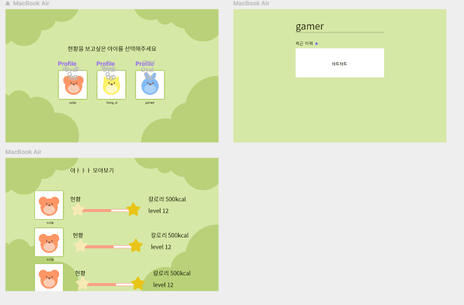
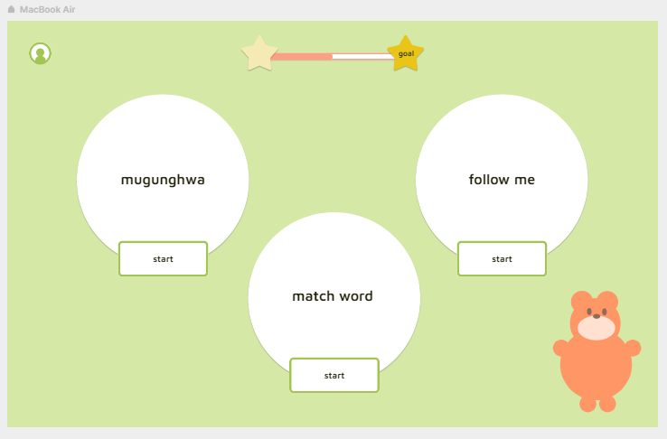
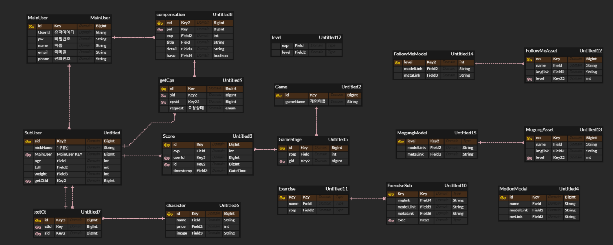

## 👨‍👨‍👦‍👦Member

| Name     | 여정동 | 김동윤 | 박주영 | 문영화 | 최정훈 |
| -------- | ------ | ------ | ------ | ------ | ------ |
| Profile  |        |        |        |        |        |
| Position | BE     | FE     | FE     | BE     | BE     |
| Git      |        |        |        |        |        |

## 🤩Service

### Main

#### 무궁화 꽃이 피었습니다

#### 나 처럼 해봐요

### AUTH

#### JOIN

#### LOGIN

#### UPDATE & DELETE

#### Player ADD

#### Player Detail

#### COMPENSATION

## 😎배포 플로우

## 🎨화면 설계서

#### Auth

#### Game

## 👨‍👩‍👧ERD

## 🖥️ EC2 포트

| Port    | 이름                          |
| ------- | ----------------------------- |
| 443     | HTTPS                         |
| 80      | HTTP - HTTPS로 리다이렉트     |
| 3306    | MYSQL                         |
| 9090    | Jenkins                       |
| 8080    | Spring boot Docker Container  |
| 80, 443 | React, Nginx Docker Container |

## 👨‍👨‍👦‍👦 협업 툴

- Git
- JIRA
- Notion
- Mattermost
- Gather town

## ✨기술 스택

#### BackEnd

    
기술스택 & 라이브러리

    <h4>기술스택 ⚙</h4>
    <ul>
        <li>JAVA @openjdk 1.8.0_192</li>
        <li>Spring-boot @2.5.5</li>
        <li>MYSQL @8.0.27</li>
        <li>STS @3.9.14.RELLASE</li>
    </ul>
    <h4>라이브러리 📚</h4>
    <ul>
        <li>JPA</li>
        <li>JWT</li>
        <li>Spring Security</li>
        <li>lombok</li>
        <li>modelmapper</li>
        <li>mysql-connector-java</li>
        <li>MobileNet</li>
        <li>Tensorflow</li>
    </ul>

#### FrontEnd

    
기술스택 & 라이브러리

    <h4>기술스택 ⚙</h4>
    <ul>
        <li>JAVA @openjdk 1.8.0_192</li>
        <li>Spring-boot @2.5.5</li>
        <li>MYSQL @8.0.27</li>
        <li>STS @3.9.14.RELLASE</li>
    </ul>
    <h4>라이브러리 📚</h4>
    <ul>
        <li>JPA</li>
        <li>JWT</li>
        <li>Spring Security</li>
        <li>lombok</li>
        <li>modelmapper</li>
        <li>mysql-connector-java</li>
        <li>MobileNet</li>
        <li>Tensorflow</li>
    </ul>

## 📜Project Docs

[Notion](https://www.notion.so/a8fb48ff8642477197050c4d672b69a4)

